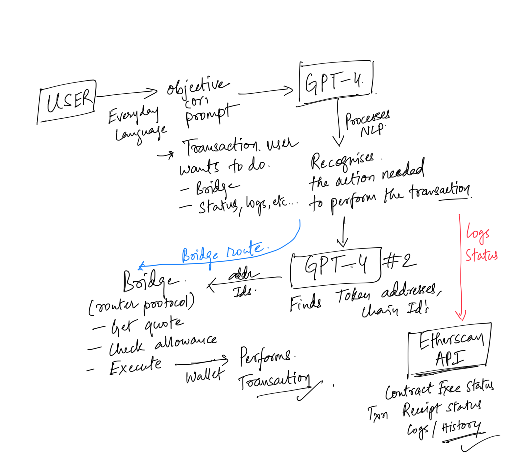

# Objective
Leveraging power of Large Language Models (LLMs) and Natural Language Processing (NLP) to make cryptocurrency transactions effortless.

# Road Map


# Clone or fork this repository

```sh
(https://github.com/Anuj-cs20/LLM-GPT)
```

## Lets Build

Clone the repository in your local.

```
git clone https://github.com/Anuj-cs20/LLM-GPT
```
Install the necessary packages

```
npm install
```

Ensure that your MetaMask wallet is already installed in Chrome, and directly fill in the API keys for both ChatGPT and Etherscan within the code itself.

Run on localhost

```
npm start
```
Your application will start running

# Demo video

[Watch the Video on Loom](https://www.loom.com/share/5f28db3e354f44e595e10c8ed71a7d5c?sid=1c77375a-1483-4168-8594-3c1e4043dca6)

# Future Scope
While the initial scope may focus on transactions, this technology could potentially be extended to other areas of blockchain interaction, such as smart contract execution, NFT management, decentralized finance (DeFi) interactions, and more
